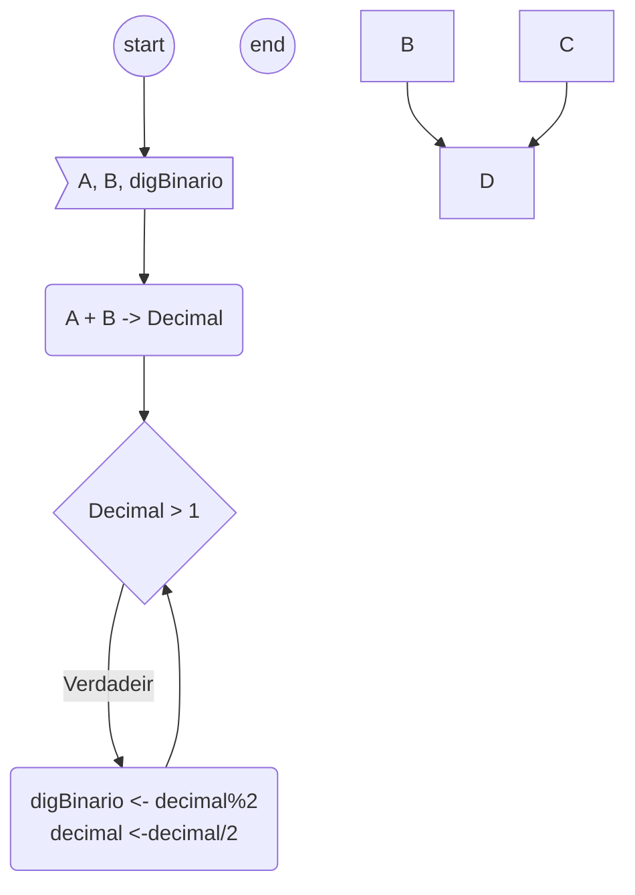

```mermaid
graph TD;
    start1((start));
    end1((end));
    input> A, B, digBinario];
    proc(A + B -> Decimal);
    loop1{Decimal > 1};
    resto(digBinario <- decimal%2\n decimal <-decimal/2)
    start1-->input;
    input-->proc;
    proc-->loop1;
    loop1--Verdadeiro-->resto;
    resto-->loop1;
    B-->D;
    C-->D;
```